# 🛡️ InsureYouAI

> 🎓 Bu proje, **Murat Yücedağ** hocamızın hazırladığı Udemy'de bulunan 

> **"ASP.NET Core ile Yapay Zeka Entegrasyonları: Sigorta Projesi"** eğitim serisi kapsamında geliştirilmiş, sigorta sektörüne özel bir AI destekli yönetim sistemidir.

[📺 Eğitim serisine buradan ulaşabilirsiniz](https://www.udemy.com/course/aspnet-core-ile-yapay-zeka-entegrasyonlar-sigorta-projesi/)

---

## 📋 Proje Hakkında

InsureYouAI, sigorta sektörüne özel, yapay zeka destekli bir yönetim ve müşteri hizmetleri platformudur. Proje, modern AI teknolojilerini kullanarak sigorta operasyonlarını otomatikleştirir, müşteri deneyimini iyileştirir ve iş süreçlerini optimize eder.

---

## 🎯 Temel Özellikler

- **🤖 AI Destekli Chat Asistanı**: SignalR ile gerçek zamanlı sohbet, GPT-4o-mini ile akıllı yanıtlar
- **📊 Makine Öğrenmesi ile Tahmin**: ML.NET TimeSeries ile poliçe satış tahminleri
- **📄 PDF Poliçe Analizi**: Claude AI ile otomatik poliçe analizi ve özetleme
- **🎯 Akıllı Paket Önerisi**: Kullanıcı profiline göre AI destekli sigorta paketi önerisi
- **📧 Otomatik Mesaj Kategorizasyonu**: Gemini AI ile mesaj kategorilendirme ve öncelik belirleme
- **🌐 Web Arama ve Özetleme**: Tavily API + OpenAI ile güncel bilgi arama ve özetleme
- **🎤 Ses Sentezi**: ElevenLabs ile metinden sese dönüşüm
- **🖼️ Görüntü Oluşturma**: OpenAI DALL-E ile görsel içerik üretimi
- **👤 Kullanıcı Profil Analizi**: Makale ve yorum analizi ile içerik ve davranış analizi
- **📈 Dashboard ve Raporlama**: Chart.js ile görselleştirme ve istatistikler

---

## 🛠️ Kullanılan Teknolojiler

### 📌 Backend

- **ASP.NET Core 9.0**
- **ASP.NET Core MVC** 
- **Entity Framework Core**
- **MS SQL Server**
- **ASP.NET Core Identity**
- **SignalR** - Gerçek zamanlı chat ve bildirimler
- **REST API**
- **SOLID Prensipleri**
- **Microsoft ML.NET** - Makine öğrenmesi framework'ü
- **Microsoft.ML.TimeSeries**
- **MailKit**
- **PdfPig** - PDF metin çıkarma

### 📌 AI Servisleri

#### 🤖 Microsoft ML.NET
- **Microsoft ML.NET** - Makine öğrenmesi
- **Microsoft.ML.TimeSeries** - Zaman serisi analizi ve tahmin (SSA - Singular Spectrum Analysis algoritması ile poliçe satış tahminleri)

#### 🤖 OpenAI API
- **GPT-4o-mini** - Gerçek zamanlı chat asistanı
- **GPT-4o-mini** - Sigorta paketi önerisi ve kullanıcı profili analizi
- **GPT-4o-mini** - İçerik analizi (makale analizi, yorum analizi)
- **GPT-4o-mini** - Web arama sonuçlarının özetlenmesi
- **DALL-E** - Görüntü oluşturma

#### 🤖 Google Gemini API
- **gemini-2.5-pro** - Mesaj kategorizasyonu (Kasko, Trafik Sigortası, Sağlık Sigortası, vb.)
- **gemini-2.5-pro** - Mesaj öncelik tahmini (High, Medium, Low)

#### 🤖 Claude AI (Anthropic)
- **claude-sonnet-4-20250514** - PDF poliçe analizi ve özetleme
- **claude-3-haiku-20240307** - Otomatik müşteri mesaj yanıtlama

#### 🤖 ElevenLabs API
- **eleven_multilingual_v2** - Metinden sese dönüşüm (Türkçe destekli)

#### 🤖 Tavily API
- Web araması ve içerik toplama (OpenAI ile entegre özetleme)

### 📌 Frontend

- **HTML5**
- **CSS3** 
- **JavaScript** 
- **Bootstrap** 
- **jQuery**
- **SignalR JavaScript Client**
- **Chart.js**

---

## 🖼️ Ekran Görüntüleri

### 🏠 Ana Sayfa

  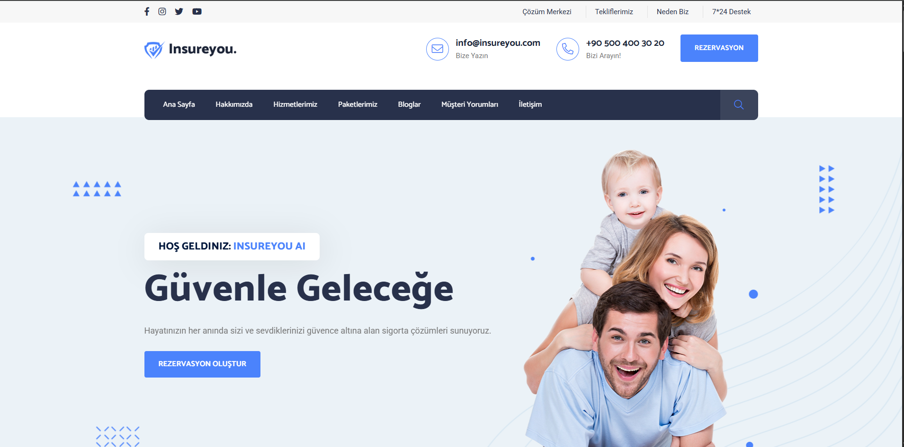
  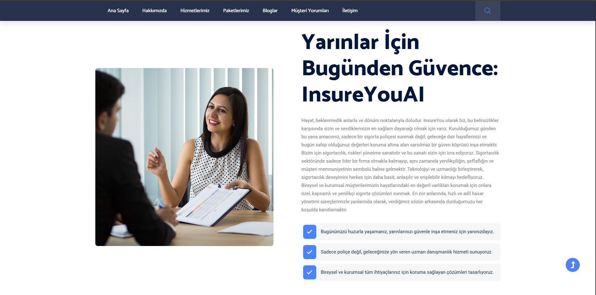
  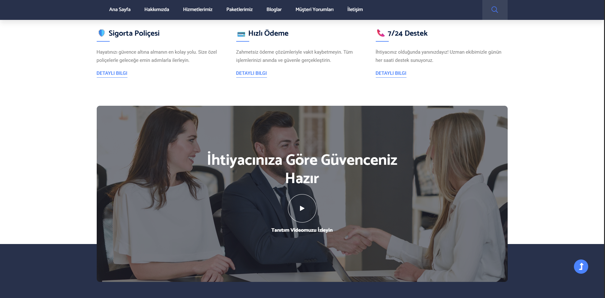
  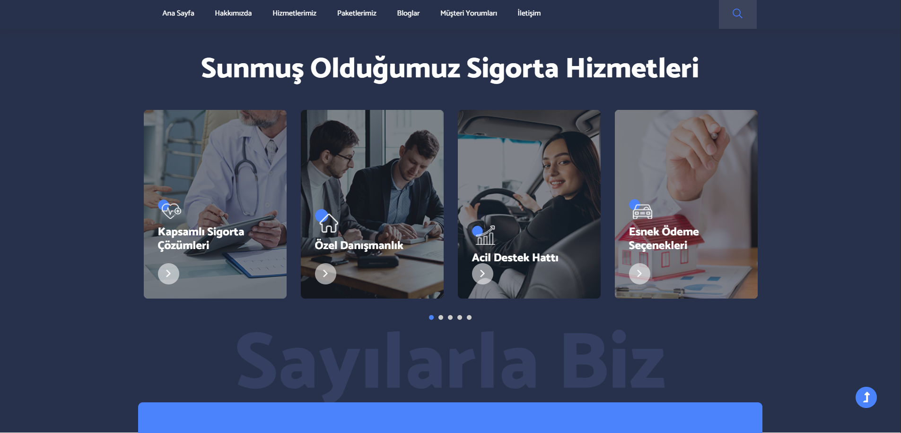
  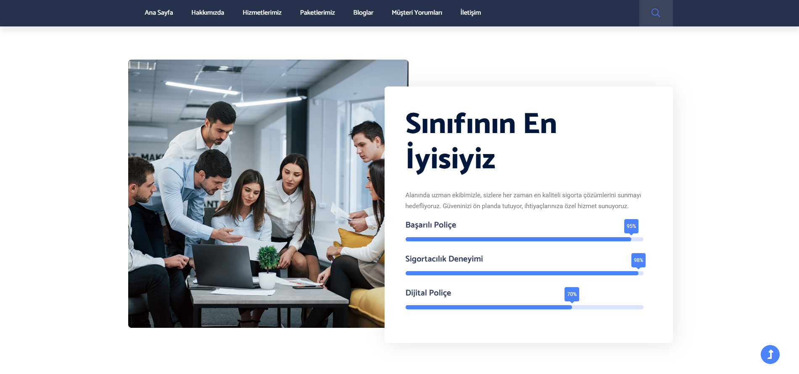
  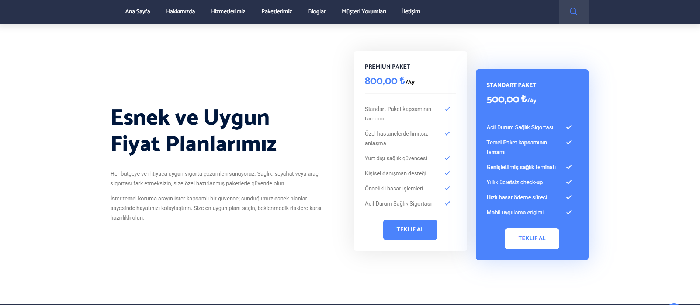
  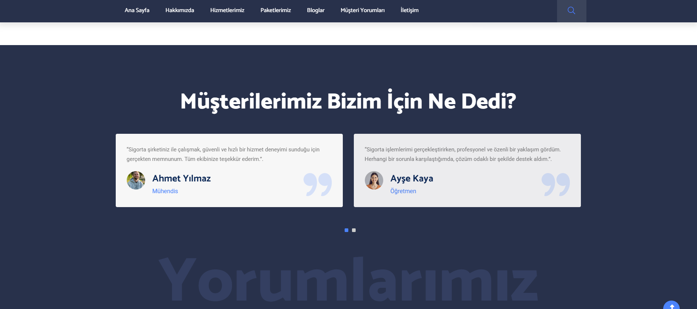
  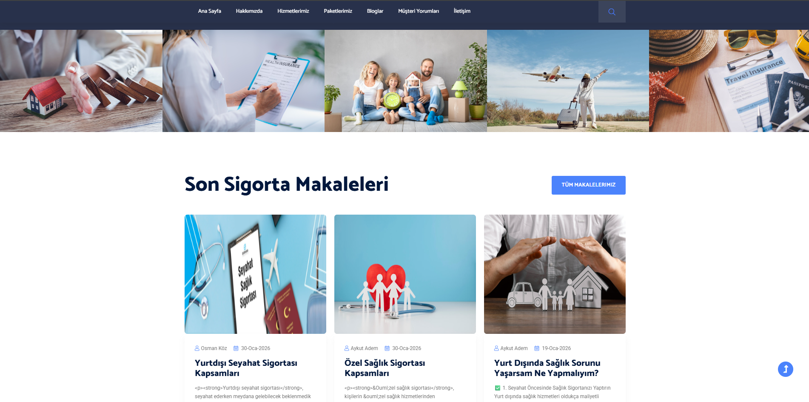
  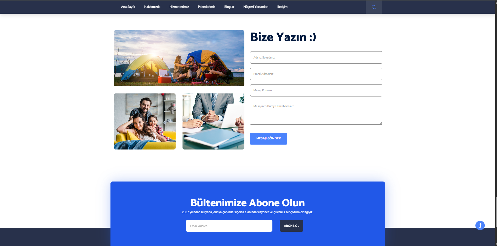
  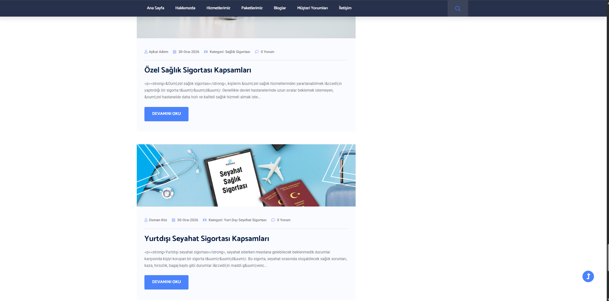
  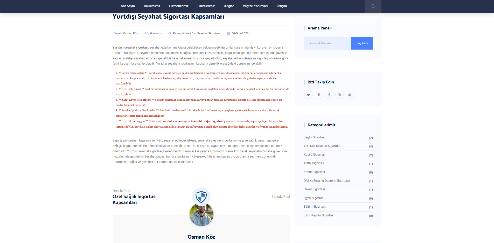

### 🔐 Admin Paneli

  
  
  
  
  
  
  
  
  
  
  

### 🔑 Login ve Register Sayfası

  
  

### 🗄️ Database Diyagram

  

### ⚠️ Hata Sayfası

  

---

